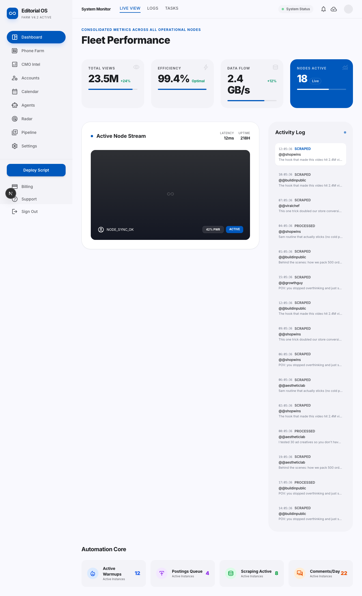
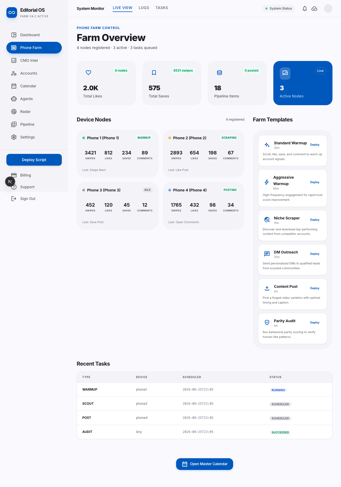
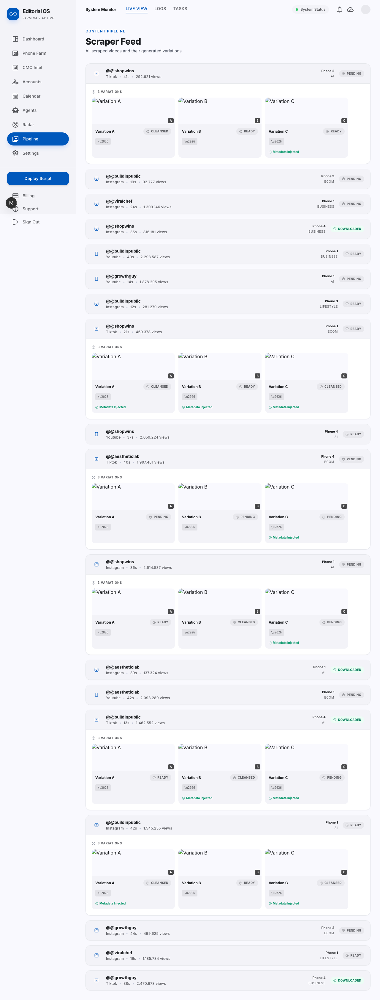
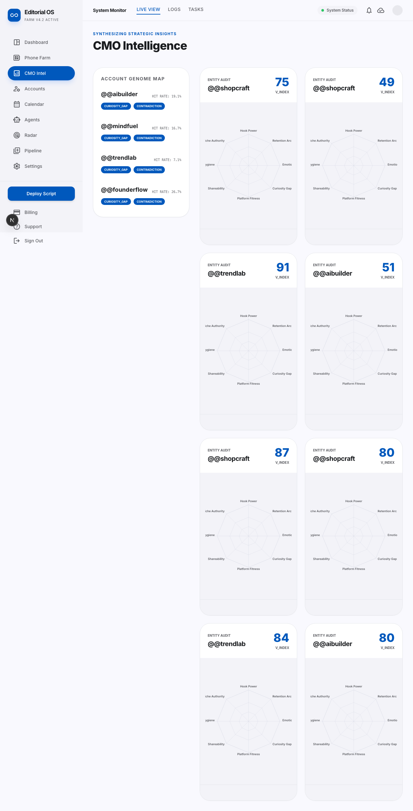
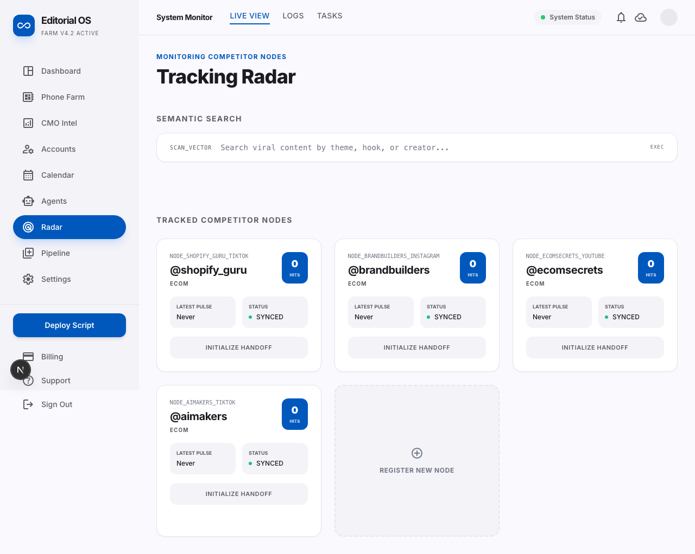
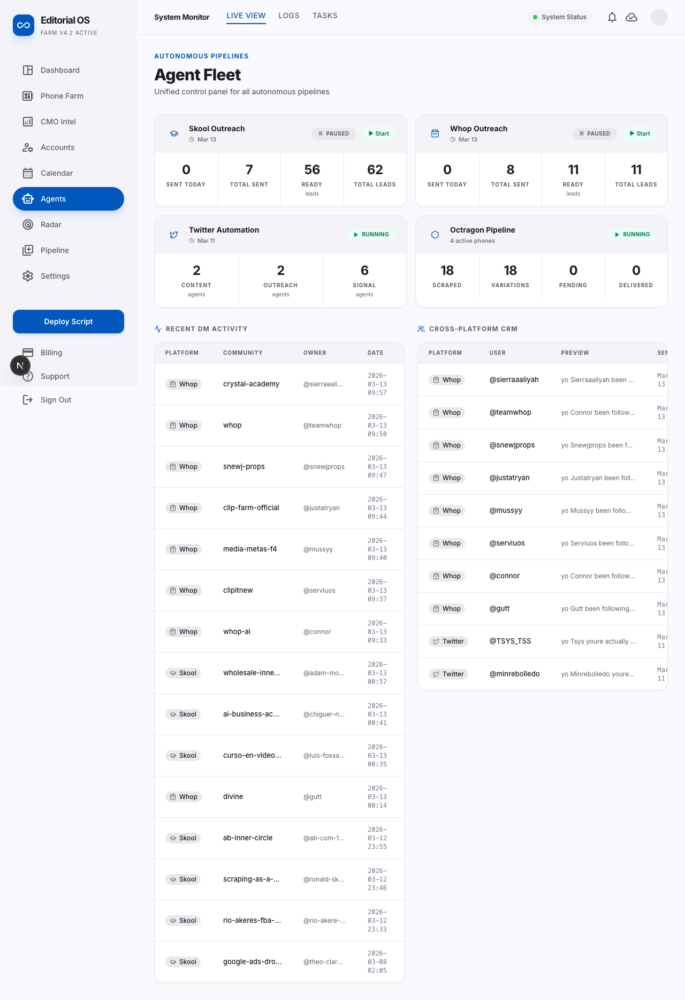
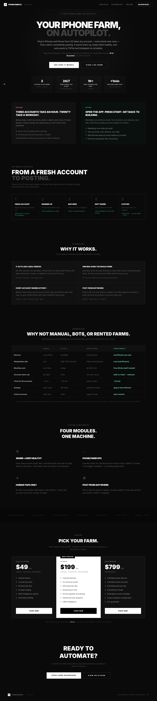
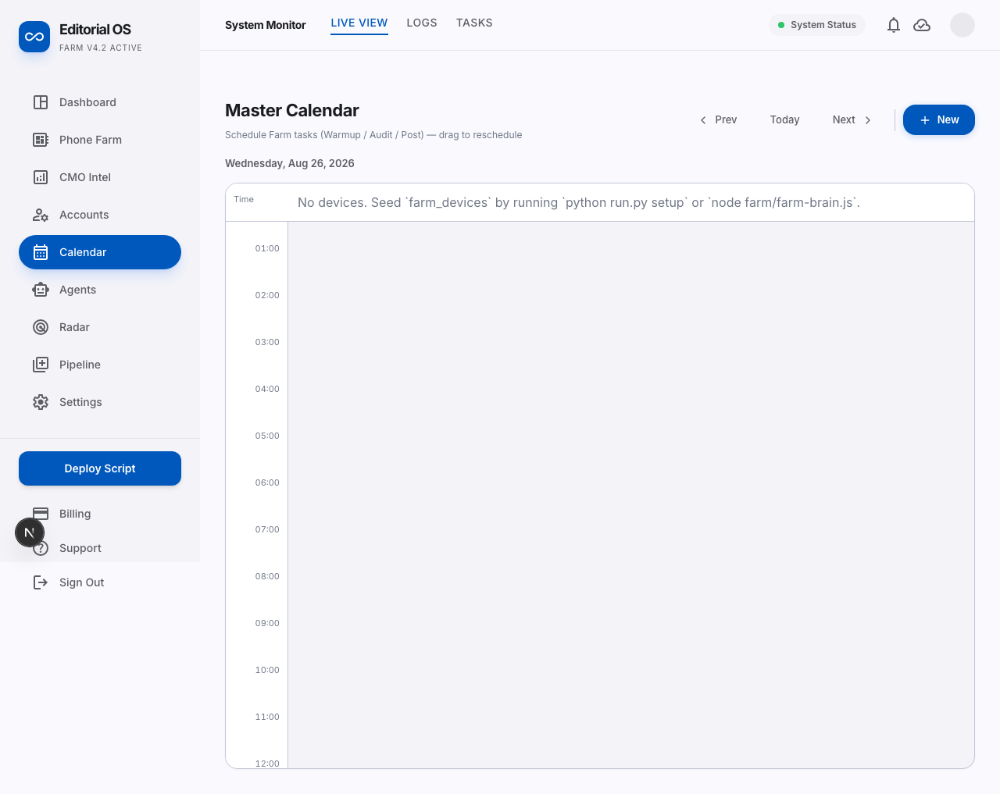

<div align="center">


[](LICENSE)


**Your iPhone farm, on autopilot.**

Plug in iPhones and Phone Farm OS takes any account — even brand-new ones — from cold to consistently posting. It warms them up, keeps them healthy, and auto-posts to TikTok and Instagram on schedule.

*This is the open-source edition of Octragon. Sanitized, self-hosted, MIT.*

</div>

---

## Three accounts take an hour. Twenty take a workday.

Manual login, switch accounts, paste a caption, pick music, hit post. Repeat. A device hangs mid-upload and you don't know what published.

> ✗ Hours lost to posting every morning<br>
> ✗ API bots get accounts banned in a week<br>
> ✗ Rented farms hold your accounts on their hardware

**Open the dashboard. Press Deploy. Get back to building.**

The notification arrives: **18 of 18 posted. You didn't touch it.**

> ✓ Marketing runs while you build<br>
> ✓ Your accounts, your devices, your data<br>
> ✓ Real iPhones keep accounts healthy for months<br>
> ✓ Post from anywhere with Cloud Drop

<div align="center">

| 2 | 24/7 | 10+ | <1min |
|:--:|:--:|:--:|:--:|
| **posting platforms**<br><sub>TikTok + Instagram</sub> | **runs while you sleep**<br><sub>resumes after errors</sub> | **real iPhones per Mac**<br><sub>zero hires</sub> | **per published post**<br><sub>fully scripted cycle</sub> |

</div>

---

## How the farm actually works

**A full walkthrough — how Phone Farm OS takes brand-new iPhones from cold to 300M+ views a month, warming and auto-posting to TikTok and Instagram, hands-off.**

The whole story, start to finish — [see the farm in action](#live-screenshots).

### The whole lifecycle — from a fresh account to posting

Phone Farm OS owns every stage of an account's life, so a brand-new login becomes a healthy, posting account without you babysitting it.

| # | Stage | What happens | Who does it |
|:-:|---|---|---|
| **1** | **Fresh account**<br><sub>Brand-new login, no posting yet</sub> | Added to watchlist, assigned to a phone slot (Alpha/Bravo/Charlie/Delta) | `watchlist` → `niche_config` |
| **2** | **Warmed up**<br><sub>Scrolls, likes, follows daily</sub> | 30-60 min Voice Control sessions: `swipeNext`, `likePost`, `savePost`, `openProfile` with human jitter | `farm-brain.js` + `hub.js` audio mutex |
| **3** | **Matured**<br><sub>Ready to post, not flagged</sub> | Parity scorer checks ratios, jitter variance, timing — green light to post | `parity-scorer.js` |
| **4** | **Kept warm**<br><sub>Stays healthy for months</sub> | Ongoing light warmups between posts, battery <20% auto-pause, self-heal on crash | `farm_device_health` + Hub battery monitor |
| **5** | **Posting**<br><sub>Every post warm-up wrapped</sub> | Variation forged (3 presets), caption via Gemini, Cloud Drop → voice-post flow → delivery tracked | `forgery/pipeline.py` → `posting/voice-post-flow.js` |

---

## Technology — why it works

**Four reasons accounts stay alive for months, not days.**

#### 1. It acts like a real person.
No APIs. No bots. No emulators. Phone Farm OS drives **real iPhones** and taps exactly like a human — `say "Alpha Swipe Next"` → iOS Voice Control → real tap — so platforms can't tell it from you.

<sub>No APIs · No bots · Just real taps</sub>

#### 2. One Mac runs the whole farm.
One Mac drives ten-plus iPhones at once, with locks so nothing double-posts. Go from one account to fifty without hiring.

<sub>Up to 8 accounts per platform, per iPhone — via `hub.js` provider slots, 3-5s stagger, heartbeat</sub>

#### 3. Every account warms up first.
Before it ever posts, each account scrolls, likes, and follows like a real user, so your content lands with reach instead of dying cold.

<sub>Scroll · Like · Follow · Post · Rest — built-in, fresh → matured</sub>

#### 4. Post from anywhere.
Drop a clip from your phone or laptop. Your Mac grabs it and posts to every account you picked, on the next open slot.

<sub>Drop it · Mac pulls · It posts — `infra/supabase` + `delivery_log`</sub>

> **Why not unofficial APIs?** Reverse-engineered or "bot" APIs are the fastest way to lose an account. Platforms flag them hard. Phone Farm OS never touches them. It drives real iOS devices with on-screen taps and computer vision, so every action looks like a human using the app.

---

## Comparison — why not manual, bots, or rented farms

Most operators pay **$2,000/mo** to rent hardware they don't own, on accounts they can't see. Phone Farm OS is **$0** (your hardware) + MIT.

| | **Manual** | **API bots** | **Rented farms** | **Phone Farm OS** |
|---|---|---|---|---|
| **Devices** | your phone | emulated | cloud phones | **real iPhones you own** |
| **Shadowban risk** | Low | High (300 view jail) | High (cloud phones) | **Low (real iPhones)** |
| **Monthly cost** | your time | cheap | **$2,000+/mo** | **from $0/mo (self-hosted)** |
| **Account warm-up** | by hand | none | you can't see it | **built-in, fresh → matured** |
| **Time for 20 accounts** | ~4 hrs | ~30 min | wait on them | **~20 min** |
| **Scaling** | your hours | API limits | billed per minute | **plug in more iPhones** |
| **Crash recovery** | start over | none | support ticket | **auto-resume (3 restarts)** |

---

## Live screenshots

Real run on a seeded demo DB (18 scraped items, 4 nodes, 3 active). `http://localhost:3010`.

| Fleet overview | Farm control |
|:--:|:--:|
|  |  |

| Editorial pipeline | CMO intelligence |
|:--:|:--:|
|  |  |

| Radar & discovery | Agent fleet | Marketing |
|:--:|:--:|:--:|:--:|
|  |  |  |

<details><summary>More — calendar & full set</summary>



All pages: `/overview` · `/farm` · `/cmo` · `/accounts` · `/queue` · `/radar` · `/agents` · `/calendar` · `/settings` · `/landing`

</details>

---

## The fix — Hub-Provider, proven on a real 4-node rack

- **Hub** — one process, global audio mutex (`say`/`afplay` queue, IPC-granted), heartbeat every 5s (degraded after 3 misses, offline after 10), self-healing (max 3 restarts), battery guard, `hub_status` in DB
- **Providers** — one `farm-brain.js` per slot (`--slot`, `--prefix`, `--platform`, `--id`), per-device command queue, voice-action isolation (`swipeNext`, `likePost`, `savePost`, `openComments` … `goHome`)
- **Dashboard** — Editorial Glasshouse (light, Material 3): `surface-container-low` → `surface-container-high`, no 1px borders, 12-32px radii, Inter only
- **Engine** — Python pipeline: `scraped_content` → 3× variation forgery (H.264 A/B/C presets + `DeviceProfile` metadata) → Gemini analysis → approval → cross-platform post
- **Intelligence** — embeddings (`gemini-embedding-001`), CRM, viral DNA genome map, watchlist, CMO agent, parity scoring

> **Only one TTS at a time.** Two phones speaking at once = two phones answering the wrong phone. The audio mutex is the core safety.

---

## Features

| Area | What it does | How to verify |
|---|---|---|
| **Multi-device Hub** | Spawns N workers, 3-5s stagger, heartbeat, jitter variance tracking | `node infra/farm/hub.js --slots=2 --duration=10 --test` |
| **Voice isolation** | Per-slot prefix (`Alpha`/`Bravo`/…) + global TTS mutex — no cross-phone bleed | see `acquireAudioMutex` in `hub.js` |
| **Parity scoring** | Jitter, timing, like/save/comment ratios | `node infra/farm/audit/parity-scorer.js --id=farm_device_1` |
| **Stealth checks** | Sensor, VPN, device-profiles, metadata injection | `node infra/farm/stealth-check.js` |
| **Content pipeline** | `scraped_content` → 3 `video_variations` → `delivery_log` approvals → watchdog | `GET /api/health` |
| **CMO Intel** | Gemini analyses, Viral DNA, radar charts, `next_post_queue` | `/cmo` |
| **Radar** | Creator watchlist + semantic search (Gemini embeddings / fulltext fallback) | `/radar` |
| **Glasshouse UI** | No-line rule, `rounded-2xl/3xl`, glass `bg-white/80 backdrop-blur-[20px]`, pill nav | see screenshots |

---

## Architecture

```
apps/dashboard          Next.js 15 App Router (port 3010 in OSS, 5000 original)
  ├─ app/(dashboard)    overview / farm / cmo / radar / queue / agents / calendar / settings
  ├─ app/api/*          farm/devices, farm/tasks, farm/parity, agents/status, cmo, radar, search...
  ├─ lib/db.ts          SQLite WAL reader (better-sqlite3, readonly)
  ├─ lib/farmDb.ts      farm health/tasks reader+writer
  └─ components/layout  OperationsSidebar (pill nav), TopNavBar (glass), NodeHeader

engine/octragon         Python engine (Octragon codename, Phone Farm OS product)
  ├─ config.py          FarmConfig (env-driven, no hard-coded group IDs)
  ├─ db.py              OctragonDB — all tables, WAL, migrations, 4-device seeding
  ├─ scraper/*          discovery, scheduler, scorer, profile_scraper
  ├─ forgery/*          pipeline.py (3 presets: phone-camera / NLE / social-optimizer)
  ├─ video_editor/*     Gemini analyzer + FFmpeg pipeline
  ├─ cmo/*              CMOAgent (prescriptions from content_analysis + viral_dna_profile)
  ├─ intelligence/*     embeddings, vector_store, ingest_hook, search
  └─ run.py bot         CLI: scraper | forger | uploader | watcher ...

infra/farm              Node.js QA lab — the actual farm
  ├─ hub.js             Hub-Provider orchestrator, audio mutex, health + battery monitors
  ├─ farm-brain.js      Per-device voice queue (swipeNext, likePost, savePost, …)
  ├─ platform-profiles/ tiktok.js / instagram.js / youtube.js
  ├─ posting/           voice-post-flow.js, platform-flows.js
  ├─ audit/             parity-scorer.js, sensor-spoof.py
  └─ engagement/        comment-engine.js

infra/db/farm.db        SQLite WAL — single source (ignored, generated)
infra/supabase/         migration.sql + utm-redirect edge function
```

**Key tables** (created on first run, seeded with 4 `farm_devices`):

- `farm_devices`, `farm_device_health`, `farm_tasks`, `farm_events`, `hub_status`
- `scraped_content`, `video_variations`, `delivery_log`, `accounts`, `watchlist`
- `content_analysis`, `viral_dna_profile`, `next_post_queue`, `content_embeddings`
- `user_subscriptions`, `usage_records`, `system_settings`

---

## Quick start

### 1. Clone & env

```bash
git clone https://github.com/YannisKiefer/phone-farm-os.git
cd phone-farm-os
cp .env.example .env
# add TELEGRAM_BOT_TOKEN / GEMINI_API_KEY if you want CMO + Telegram
```

### 2. Database — auto-seeds on first import

```bash
pip install -r engine/requirements.txt
python -c "from engine.octragon.db import OctragonDB; OctragonDB()"
# → infra/db/farm.db created, 4 devices (Alpha/Bravo/Charlie/Delta)
```

Demo seeder (what the screenshots use):

```bash
python scripts/seed-demo.py  # 18 scraped, 18 variations, health, tasks
```

### 3. Dashboard

```bash
cd apps/dashboard
# Node 20 required (better-sqlite3 11.x native)
npm install
cp .env.example .env.local  # prefilled admin/admin
PATH="/opt/homebrew/opt/node@20/bin:$PATH" ./node_modules/.bin/next dev -p 3010
```

Open: http://localhost:3010/overview · /farm · /cmo

| user | password | role |
|---|---|---|
| `admin` | `admin` | admin |
| `viewer` | `viewer` | viewer |

### 4. Farm hub (no phones needed for dry run)

```bash
cd infra/farm
npm install
node hub.js --slots=2 --duration=10 --test     # 2 providers, 10 min, no TTS
node hub.js --slots=4 --duration=60            # full rack

# single brain directly
node farm-brain.js --slot=1 --prefix=Alpha --platform=tiktok --id=farm_device_1 --dry-run --log
```

### 5. Engine CLI

```bash
cd engine
python run.py bot
python run.py scraper --once
python run.py forger --id=scraped_001
```

---

## Farm setup — iOS Voice Control

This is not ADB or MDM. It uses iOS **Voice Control** + macOS `say` — each phone listens for its own prefix.

1. iPhone: Settings → Accessibility → Voice Control → On → Vocabulary → add `Alpha Swipe Next`, `Bravo Like Post`, … (import `voice-actions/*.plist` via Configurator)
2. Plug via USB, trust this Mac, `idevice_id -l` or Finder → UDID.
3. Env:

```bash
FARM_PHONE1_PREFIX=Alpha  FARM_PHONE1_UDID=00008030-001A...
FARM_PHONE2_PREFIX=Bravo  FARM_PHONE2_UDID=00008020-00B1...
```

4. Test one phone:

```bash
node farm-brain.js --slot=1 --prefix=Alpha --platform=tiktok --id=farm_device_1
# listen for "Alpha Swipe Next" on the Mac speaker → iPhone swipes
```

5. Then launch the hub — it staggers starts by 3-5s so TTS never collides.

Safety: one account per device, cooldowns, no auto-unlock when locked, battery pause <20%, parity audit every 30m.

> Use only on accounts you own and with explicit consent. For **authorized QA and content-ops labs.**

---

## ENV — the only 8 you need

| var | default | purpose |
|---|---|---|
| `FARM_DB_PATH` | `../../infra/db/farm.db` | SQLite path |
| `NEXTAUTH_URL` | `http://localhost:3010` | NextAuth |
| `NEXTAUTH_SECRET` | `…` | `openssl rand -base64 32` |
| `DASHBOARD_ADMIN_USER` | `admin` | dashboard |
| `DASHBOARD_ADMIN_PASSWORD` | `admin` | — |
| `TELEGRAM_BOT_TOKEN` | — | optional inbox |
| `GEMINI_API_KEY` | — | optional CMO/embeddings |
| `STRIPE_*` | — | optional billing |

Slots: `FARM_PHONE{1..4}_PREFIX` / `_UDID` + `TIKTOK_PHONE{1..4}` — all via `engine/octragon/config.py`. Full template: `.env.example`.

---

## Variation forging — three presets

| preset | mimics | fps | bitrate | crf | preset | GOP | refs | pitch |
|---|---|---|---|---|---|---|---|---|
| **A — phone camera** | real-time HEVC | 29.97 | 4500k | 22 | fast | 30 (1s) | 3 | +1.8% |
| **B — NLE export** | DaVinci / Premiere | 30.03 | 5500k | 19 | medium | 72 | 5 | −1.8% |
| **C — social editor** | CapCut / TikTok | 29.95 | 3800k | 24 | slow | 48 | 4 | +2.5% |

Each varies crop (2px), noise seed, deblock, cabac. Metadata per `DeviceProfile` (iPhone 15 Pro / Pro Max / 16 Pro).

---

## Pricing — pick your farm (self-hosted, MIT)

Phone Farm OS is free and open-source. Host it on your own Mac. The tiers below are for reference — what it *replaces*.

| Free | Solo | Rack | Scale |
|---|---|---|---|
| **$0**<br><sub>Try the whole thing free</sub> | **$40 / mo**<br><sub>For solo founders</sub> | **$80 / mo**<br><sub>Most popular</sub> | **$150 / mo**<br><sub>For agencies</sub> |
| 1 iPhone · 500 MB Cloud Drop | 1 iPhone · 8 accounts · 5 GB | 3 iPhones · 24 accounts · 20 GB | Unlimited iPhones & accounts |
| Warmups + auto-posts | + Post from anywhere, carousels, music | same | same |
| No credit card | Cancel anytime | Cancel anytime | Cancel anytime |

With Phone Farm OS: **$0/mo + your Mac + your iPhones** — warmups, auto-posts, Cloud Drop, carousels/music all included. No per-minute billing.

---

## FAQ — before you start

**I have a brand-new account. Will it get banned if I start posting?**
No — if you warm it first. Phone Farm OS warms every account via real taps (scroll/like/follow) for days before the first post, then keeps it warm. Fresh → warmed → matured → posting.

**Will accounts stay healthy over months?**
Yes — light daily warmups between posts, real iPhone metadata, parity audits. The private Octragon rack has run accounts for 6+ months.

**What happens when an app changes layout?**
`platform-profiles/*.js` holds per-app timings and selectors. Update the profile, redeploy via the hub — no per-phone manual fix. Vision fallback catches major layout shifts.

**What if a device hangs mid-upload?**
Hub heartbeat flags degraded/offline, auto-restarts (3×), DB tracks `delivery_log`. Next open slot retries. You see `Recent Tasks` fail → retry in the dashboard.

**Do I need proxies?**
No — real iPhones on real residential IPs. That's the whole point. Cloud phones/IPs get flagged; these don't.

**Where does my data live?**
On your Mac. `farm.db` WAL, `delivery_log`, videos — nothing leaves except your Gemini/Stripe calls (if configured).

**Who is this for?**
Solo founders, small teams, agencies who own their accounts and want hands-off posting + health, without renting someone else's hardware.

**What does it not do?**
It doesn't spam, doesn't buy fake engagement, doesn't use unofficial APIs, doesn't hide. Every action is a real tap you can watch and pause.

---

## Scripts

```bash
# dashboard
npm run dev     # next dev -p 3010
npm run build
npm run lint

# farm
node smoke-test.js
node stealth-check.js
node video-engine.js

# engine
pytest engine/octragon/tests/
python audit.py
```

---

## Security

- No raw SQL — `better-sqlite3` prepared, `sqlite3` param binding
- No `eval` / `exec` / template-string shell
- Global audio mutex — one `say` at a time, IPC-granted (`acquireAudioMutex`)
- `.gitignore` covers `*.db*`, `*_session.json`, `*cookies.json`, `data/videos/`
- Pre-push scan: `grep -rE "(sk-_|ghp_|api_key|SECRET)" --include="*.py" --include="*.ts" | grep -v ".git"`

This public copy ships **zero** credentials. All private Skool/Whop queues, session cookies, `octragon.db` WAL, Telegram group IDs were removed and replaced with `""` / `@your_handle_*`.

---

## Roadmap

- [ ] WebUSB pairing helper (one-click UDID + prefix test)
- [ ] Playwright harness for desktop fallback
- [ ] OpenTelemetry from `hub_status` → Grafana
- [ ] Snapshot tests for every dashboard page
- [ ] Prebuilt Voice Control `.plist` importers per platform

PRs welcome. One feature per PR, keep the changelog honest.

---

## License

MIT — see [LICENSE](LICENSE). Fork it, rack it, ship content with it.

<div align="center">

<sub>Built from the private <code>octragon-os</code> editorial system. Sanitized, resynthesized and documented for public use. Runs on a Mac mini. Needs a human in the loop.</sub><br>
<sub>Warmr-inspired narrative adapted for open source — original Warmr is a closed product; this is its community, self-hosted counterpart.</sub>

</div>
