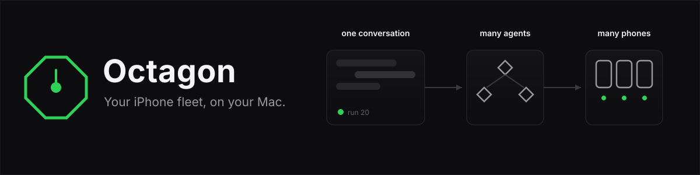
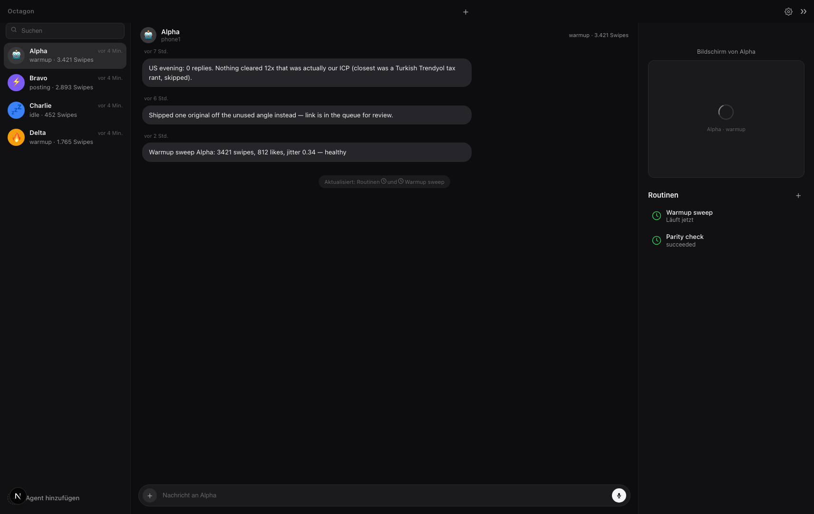
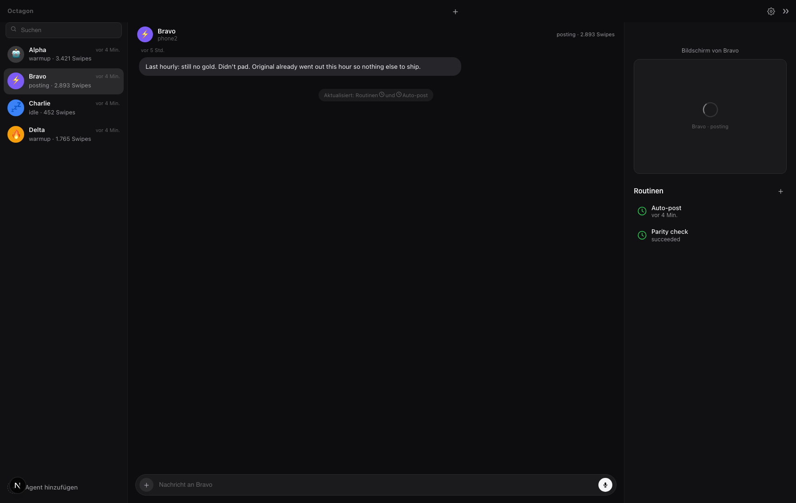
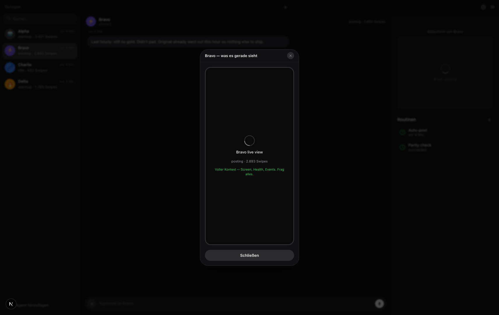

<div align="center">



[](LICENSE)


# Your iPhone farm, on autopilot.

**Plug in iPhones. Chat with them. They warm up, stay healthy, and post on schedule.**

[Quick start](#quick-start) · [How it works](#how-it-works) · [Hermes + MCP](#hermes--mcp) · [FAQ](#faq)



</div>

---

## One chat. Every phone.

No dashboard maze. No cloud. Your farm is a chat:

- **Left** — your phones as agents. Click one to talk to it.
- **Center** — the conversation. *"warm bravo 20 min"* → it starts warming and reports back.
- **Right** — what the phone sees, and its routines.

Everything a phone does lands in the chat. Everything you say becomes work.

| | |
|:--:|:--:|
|  |  |

## How it works

**Real taps, not APIs.** Octagon speaks to iPhones over iOS Voice Control — one Mac says *"Alpha Swipe Next"*, the phone taps. A global audio lock makes sure only one phone listens at a time. Jitter is log-normal with bursts, because humans don't swipe on a metronome.

```
You ──chat──> Octagon ──> hub ──> one brain per phone ──> real taps
                   │
                   └── SQLite, on your Mac. Nothing leaves it.
```

- Self-healing: a hung phone restarts itself (3 attempts) and tells you in the chat.
- Adaptive warmup: new accounts scroll and like for days before their first post.
- Add agents with one click. Drop a video into the chat — it posts on the next free slot.

## Quick start

You need: one Mac, one or more iPhones, 10 minutes.

```bash
git clone https://github.com/YannisKiefer/octagon.git
cd octagon
cp .env.example .env

# farm + demo data
pip install -r engine/requirements.txt
python scripts/seed-demo.py

# dashboard
cd apps/dashboard && npm install && npm run dev
```

Open **http://localhost:3010** — chat with your farm.

<details>
<summary><strong>Connect real iPhones</strong></summary>

1. On each iPhone: Settings → Accessibility → Voice Control → On. Create a custom command per phone: *"Alpha Swipe Next"* → swipe-up gesture.
2. Plug in via USB, trust the Mac.
3. Test one phone: `node infra/farm/farm-brain.js --slot=1 --prefix=Alpha --dry-run --log`
4. Run the farm: `node infra/farm/hub.js --slots=4 --duration=60` (add `--test` for a silent dry run)

Full guide: [infra/farm/SETUP-GUIDE.md](infra/farm/SETUP-GUIDE.md)

</details>

## Hermes + MCP

Octagon speaks [MCP](https://modelcontextprotocol.io). Point any agent at it:

```json
{ "mcpServers": { "octagon": { "command": "node", "args": ["/path/to/octagon/mcp/server.js"] } } }
```

Five tools, same farm: `list_phones` · `get_phone` · `warm_phone` · `get_events` · `get_phone_screen`.

Your Hermes agent becomes the chat. Octagon stays the hands. Details: [mcp/README.md](mcp/README.md)

## Why

| | Bots & APIs | Rented farms | **Octagon** |
|---|---|---|---|
| Accounts | banned in weeks | flagged cloud phones | **real iPhones, months** |
| Data | their servers | their hardware | **your Mac, one SQLite file** |
| Cost | cheap, then bans | $2,000+/mo | **free. MIT.** |

## FAQ

**Will a new account get banned?**
Not if it warms first — Octagon warms every account with real taps before it ever posts, then keeps it warm daily.

**Do I need proxies?**
No. Real iPhones on your own Wi-Fi is the point.

**Where does my data live?**
One file: `infra/db/farm.db`. No Supabase, no Stripe, no accounts, no telemetry.

**What it doesn't do:** no spam, no fake engagement, no unofficial APIs.

## Contributing

Small PRs, one feature at a time. `npm run build` and `node tests/test_octagon.mjs` must pass.

## License

MIT — [LICENSE](LICENSE).

<div align="center">
<sub>Runs on a Mac mini. Needs a human nearby.</sub>
</div>
