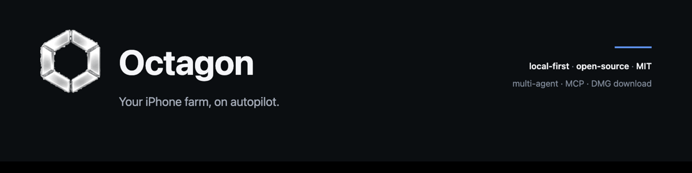
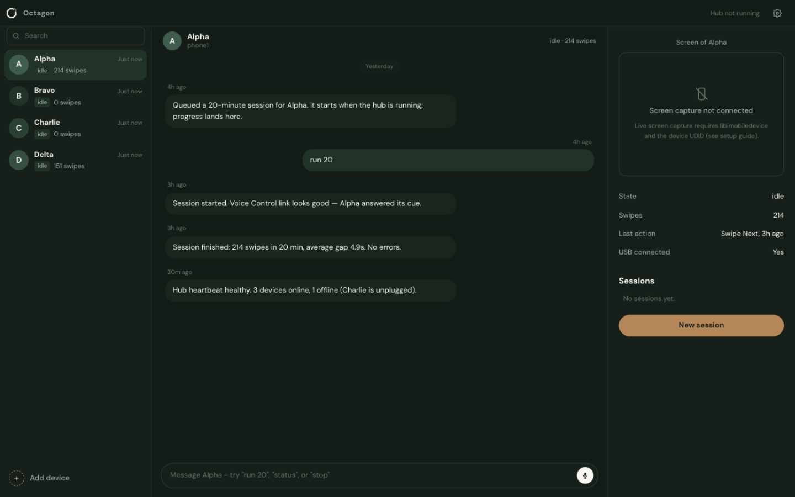

<div align="center">



[](LICENSE)


# Your iPhone farm, on autopilot.

**Plug in iPhones. Chat with them. They run on schedule, stay healthy, and report back.**

[Quick start](#quick-start) · [How it works](#how-it-works) · [Agents](#your-farm-is-staffed) · [MCP](#mcp) · [FAQ](#faq)



<sub>Synthetic demo data. Your numbers will be real.</sub>

</div>

---

## One chat. Every phone.

No dashboard maze. No cloud. Your farm is a chat:

- **Left** — your phones, with their agents and live status.
- **Center** — the conversation. *"run 20"* → a 20-minute session queues and reports back.
- **Right** — device preview, details, sessions.

Everything a phone does lands in the chat.

## How it works

**Real taps, not APIs.** One Mac says *"Alpha Swipe Next"* out loud, the iPhone's Voice Control custom command taps. A global audio lock makes sure only one phone listens at a time.

```
You ──chat──> Octagon ──> hub ──> one brain per phone ──> real taps
                   │
                   └── SQLite, on your Mac. Nothing leaves it.
```

- Self-healing: a crashed brain restarts itself (3 attempts) and tells you in the chat.
- Multi-agent: your farm is staffed. Nova dispatches, phone agents execute, handoffs happen in the chat.
- Add agents with one click. Assign them to phones. Talk to them by name.

## Your farm is staffed

Every phone gets an agent. Plus the management:

- **Nova** — the supervisor. Dispatches, answers for the whole fleet.
- **Sentry** — the monitor. Watches health, counts the queue.
- **Phone agents** — one per phone, doing the actual work.

`@Sentry status` in the chat. Or let Claude do it — Octagon speaks MCP:

```json
{ "mcpServers": { "octagon": { "command": "node", "args": ["/path/to/octagon/mcp/server.js"] } } }
```

Nine tools: phones, sessions, events, screens, agents, handoffs. Details in [mcp/README.md](mcp/README.md).

## Quick start

You need: one Mac, one or more iPhones, 10 minutes. No account, no login.

**Just want the app?** Grab the [DMG](https://github.com/YannisKiefer/octagon/releases/latest/download/Octagon-1.1.0-arm64.dmg) (Apple Silicon), drag it to Applications. Unsigned, so macOS asks once: System Settings → Privacy & Security → **Open Anyway**.

From source:

```bash
git clone https://github.com/YannisKiefer/octagon.git
cd octagon

# farm runtime
cd infra/farm && npm install && cd ../..

# demo data (optional, clearly fake)
node scripts/seed-demo.js

# dashboard
cd apps/dashboard && npm install && npm run dev
```

Open **http://localhost:3010**. That's it.

<details>
<summary><strong>Connect real iPhones</strong></summary>

1. On each iPhone: Settings → Accessibility → Voice Control → On. Create one custom command per phone: *"Alpha Swipe Next"* → swipe-up gesture.
2. Plug in via USB, trust the Mac.
3. Dry run first: `node infra/farm/farm-brain.js --slot=1 --prefix=Alpha --dry-run --log`
4. Then the fleet: `node infra/farm/hub.js --slots=4`

Full guide: [infra/farm/SETUP-GUIDE.md](infra/farm/SETUP-GUIDE.md)

</details>

## What it doesn't do

No posting, no auto-likes, no DMs, no unofficial APIs. The sessions are swipe pacing over Voice Control — nothing else, and nothing that pretends otherwise. It runs on phones you own; platform rules are yours to know.

## FAQ

**Will my accounts get banned?**
No one can promise that. Octagon has no evasion features and automates only what you set up on devices you own.

**Do I need proxies?**
No. Real iPhones on your own Wi-Fi is the point.

**Where does my data live?**
One file: `infra/db/farm.db`. Delete it and everything is gone.

## Contributing

Small PRs, one feature at a time. `npm run build` and `node tests/test_octagon.mjs` must pass.

## License

MIT — [LICENSE](LICENSE).

<div align="center">
<sub>Runs on a Mac mini. Needs a human nearby.</sub>
</div>
